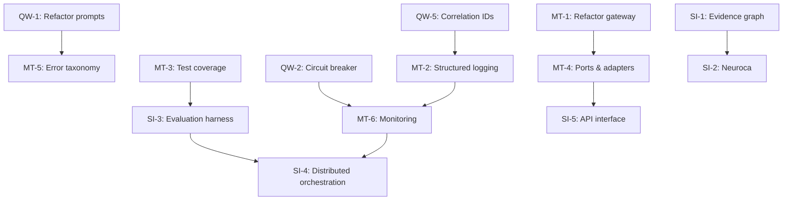

# Cogito Refactor Plan

**System:** Cogito AI Research Platform  
**Commit:** 0f51527  
**Date:** 2025-11-06  
**Priority Framework:** P0 (Critical) → P1 (High) → P2 (Medium) → P3 (Low)

---

## Executive Summary

This refactor plan addresses identified architectural gaps and technical debt in Cogito. Work items are prioritized by business impact, technical risk, and effort required. The plan spans from quick wins (1-2 days) through strategic initiatives (3-6 months).

**Total Estimated Effort:** ~16 weeks (4 months) of dedicated engineering time

**Critical Path Items:**
1. File size refactoring (2 files exceed limits)
2. Circuit breaker implementation (cost control)
3. Test coverage improvements (80% target)
4. Observability enhancements

---

## Quick Wins (1-2 Days Effort)

### QW-1: Refactor `prompt_texts.py`

**Priority:** 🔴 P0 Critical  
**Effort:** 8 hours  
**Impact:** High - Maintainability, merge conflicts, code review

**Current State:**
- Single file: 1755 LOC (exceeds 500 LOC limit by 1255 lines)
- Contains all prompt templates for all pipelines
- Difficult to navigate and modify

**Target State:**
Split into categorized modules:

```
src/prompts/
├── __init__.py                     # Exports
├── philosophical.py                # Philosophical persona prompts (~300 LOC)
├── scientific.py                   # Scientific domain prompts (~300 LOC)
├── critique.py                     # Critique-specific prompts (~300 LOC)
├── synthesis.py                    # Synthesis & aggregation prompts (~250 LOC)
├── preflight.py                    # Extraction & query planning prompts (~300 LOC)
├── thesis.py                       # Thesis generation prompts (~200 LOC)
└── common.py                       # Shared templates (~100 LOC)
```

**Migration Steps:**
1. Create `src/prompts/` directory
2. Create module files
3. Move prompts by category (maintain exact text)
4. Update imports across codebase
5. Update tests
6. Deprecate old file

**Validation:**
- All tests pass
- No prompt text changes
- Each new file < 500 LOC

---

### QW-2: Add Basic Circuit Breaker for LLM Calls

**Priority:** 🔴 P0 Critical  
**Effort:** 6 hours  
**Impact:** Critical - Cost control, rate limit protection

**Current State:**
- No circuit breaker protection
- Potential for cascading failures
- Token cost explosion risk

**Target State:**
Simple circuit breaker with token budget enforcement

**Implementation:**
```python
# src/infrastructure/circuit_breaker.py

class CircuitBreaker:
    def __init__(self, failure_threshold=5, timeout=60, budget_limit=1_000_000):
        self.failure_count = 0
        self.failure_threshold = failure_threshold
        self.timeout = timeout
        self.last_failure_time = None
        self.state = "CLOSED"  # CLOSED, OPEN, HALF_OPEN
        self.token_budget = budget_limit
        self.tokens_used = 0
    
    def call(self, func, *args, **kwargs):
        if self.state == "OPEN":
            if time.time() - self.last_failure_time > self.timeout:
                self.state = "HALF_OPEN"
            else:
                raise CircuitBreakerOpen("Circuit breaker is open")
        
        if self.tokens_used >= self.token_budget:
            raise TokenBudgetExceeded(f"Budget {self.token_budget} exceeded")
        
        try:
            result = func(*args, **kwargs)
            if self.state == "HALF_OPEN":
                self.state = "CLOSED"
                self.failure_count = 0
            return result
        except Exception as e:
            self.failure_count += 1
            self.last_failure_time = time.time()
            if self.failure_count >= self.failure_threshold:
                self.state = "OPEN"
            raise
    
    def record_tokens(self, count):
        self.tokens_used += count
```

**Integration Points:**
- Wrap all provider client calls
- Configure per-pipeline budgets
- Add monitoring/alerting

---

### QW-3: Document PII Handling Policy

**Priority:** 🔴 P0 Critical  
**Effort:** 4 hours  
**Impact:** High - Compliance, legal risk

**Deliverables:**
1. `docs/security/pii_policy.md`
2. Update README with security section
3. Add privacy notice to CLI

**Policy Content:**
- Data retention periods
- Sensitive data handling
- User consent requirements
- Data deletion procedures
- Third-party data sharing (LLM providers)
- Geographic restrictions (GDPR, CCPA)

---

### QW-4: Consolidate Configuration Sources

**Priority:** 🟡 P1 High  
**Effort:** 6 hours  
**Impact:** Medium - Consistency, deployment

**Current State:**
- `config.json` (primary)
- `config.yaml` (alternative)
- `.env` (secrets)
- CLI arguments (overrides)
- Unclear precedence

**Target State:**
Clear precedence hierarchy:

```
1. CLI arguments (highest)
2. Environment variables
3. config.json (or config.yaml)
4. Defaults (lowest)
```

**Implementation:**
```python
# src/config/loader.py

class ConfigLoader:
    PRECEDENCE = ["cli", "env", "file", "defaults"]
    
    def load(self, cli_args=None):
        defaults = self._load_defaults()
        file_config = self._load_file()  # Checks .json then .yaml
        env_config = self._load_env()
        cli_config = self._parse_cli(cli_args)
        
        # Merge with precedence
        return self._merge(defaults, file_config, env_config, cli_config)
```

**Documentation:** Add configuration guide to docs/

---

### QW-5: Add Correlation IDs

**Priority:** 🟡 P1 High  
**Effort:** 4 hours  
**Impact:** High - Debugging, tracing

**Implementation:**
```python
import uuid

class PipelineContext:
    def __init__(self):
        self.correlation_id = str(uuid.uuid4())
        self.start_time = time.time()
    
    def log(self, message, **kwargs):
        logger.info(message, extra={
            "correlation_id": self.correlation_id,
            **kwargs
        })
```

**Integration:**
- Add to all pipeline entry points
- Thread through agent execution
- Include in all log statements
- Add to output artifacts

---

## Medium-Term Improvements (1-2 Sprints)

### MT-1: Refactor `openai_gateway.py`

**Priority:** 🔴 P0 Critical  
**Effort:** 3 days  
**Impact:** High - Testability, maintainability

**Current State:**
- 1235 LOC in single file
- Handles extraction + query planning + request management
- Tight coupling

**Target State:**
```
src/infrastructure/preflight/
├── __init__.py
├── extraction_gateway.py          # Extraction LLM calls (~400 LOC)
├── query_planning_gateway.py      # Query planning LLM calls (~400 LOC)
├── request_builder.py             # Request construction (~200 LOC)
└── response_parser.py             # Response parsing (~200 LOC)
```

**Refactoring Strategy:**
1. Extract extraction logic → `extraction_gateway.py`
2. Extract query planning → `query_planning_gateway.py`
3. Extract request building → `request_builder.py`
4. Extract response parsing → `response_parser.py`
5. Update tests for each module
6. Deprecate old file

---

### MT-2: Implement Structured Logging

**Priority:** 🟡 P1 High  
**Effort:** 1 sprint  
**Impact:** High - Observability, debugging

**Target:**
- JSON-structured logs
- Consistent field naming
- Log levels properly used
- Performance metrics logged

**Implementation:**
```python
import structlog

logger = structlog.get_logger()

logger.info(
    "agent.execution.complete",
    agent_id=agent.id,
    persona=agent.persona.name,
    duration_ms=duration,
    confidence=result.confidence,
    tokens_used=result.tokens
)
```

**Standardized Fields:**
- `correlation_id`
- `component` (council, preflight, synthesis, etc.)
- `operation` (start, complete, error)
- `duration_ms`
- `tokens_used`
- `error_type` (if applicable)

---

### MT-3: Increase Test Coverage to 80%

**Priority:** 🟡 P1 High  
**Effort:** 2 sprints  
**Impact:** Medium - Quality, regression prevention

**Coverage Gaps:**
1. Provider fallback mechanisms
2. Error path testing
3. Preflight edge cases
4. LaTeX template variations
5. Vector store ranking

**Strategy:**
- Add 50+ unit tests
- Add 10+ integration tests
- Add property-based tests for parsers
- Add contract tests for providers

**Tools:**
- pytest-cov for coverage measurement
- hypothesis for property-based testing
- pytest-mock for mocking

---

### MT-4: Implement Ports & Adapters for LLM Providers

**Priority:** 🟡 P1 High  
**Effort:** 1.5 sprints  
**Impact:** Medium - Flexibility, testing

**Current State:**
- Direct provider coupling
- Inconsistent interfaces
- Testing requires real APIs

**Target State:**
```python
# src/application/ports/llm_provider.py

from abc import ABC, abstractmethod

class ILLMProvider(ABC):
    @abstractmethod
    def complete(self, prompt: str, **kwargs) -> str:
        pass
    
    @abstractmethod
    def stream(self, prompt: str, **kwargs) -> Iterator[str]:
        pass
    
    @abstractmethod
    def embed(self, text: str) -> np.array:
        pass
```

**Adapters:**
- `OpenAIAdapter`
- `AnthropicAdapter`
- `GeminiAdapter`
- `DeepSeekAdapter`
- `MockAdapter` (for testing)

---

### MT-5: Formalize Error Taxonomy

**Priority:** 🟡 P1 High  
**Effort:** 1 sprint  
**Impact:** Medium - Error handling, recovery

**Error Hierarchy:**
```python
# src/domain/exceptions.py

class CogitoException(Exception):
    """Base exception"""

class ConfigurationError(CogitoException):
    """Configuration issues"""

class ProviderError(CogitoException):
    """LLM provider errors"""
    
class RateLimitError(ProviderError):
    """Rate limit exceeded"""
    
class AuthenticationError(ProviderError):
    """API auth failed"""

class PipelineError(CogitoException):
    """Pipeline execution errors"""
    
class ValidationError(CogitoException):
    """Input/output validation errors"""
```

**Recovery Strategies:**
- `RateLimitError` → Retry with backoff or switch provider
- `AuthenticationError` → Fail fast with clear message
- `ValidationError` → Return error to user with details
- `PipelineError` → Partial results + error report

---

### MT-6: Add Performance Monitoring

**Priority:** 🟡 P1 High  
**Effort:** 1 sprint  
**Impact:** Medium - Optimization, cost control

**Metrics to Track:**
```python
# src/infrastructure/metrics.py

class MetricsCollector:
    def record_llm_call(self, provider, model, tokens_in, tokens_out, duration_ms):
        pass
    
    def record_pipeline_duration(self, pipeline, stage, duration_ms):
        pass
    
    def record_cache_hit(self, cache_type):
        pass
    
    def record_error(self, error_type, component):
        pass
```

**Aggregations:**
- Token usage per day/week/month
- Cost per critique
- Average pipeline duration
- Cache hit rates
- Error rates by type

**Visualization:**
- Grafana dashboards
- Weekly cost reports
- Performance trends

---

## Strategic Initiatives (3-6 Months)

### SI-1: Unified Evidence Graph

**Priority:** 🟢 P2 Medium  
**Effort:** 6 weeks  
**Impact:** High - Research quality, insight generation

**Vision:**
Replace fragmented vector stores with unified graph database representing:
- Papers (nodes)
- Citations (edges)
- Concepts (nodes)
- Relationships (edges)
- Claims (nodes)
- Evidence links (edges)

**Technology:**
- Neo4j or Apache AGE
- Cypher query language
- Graph embedding algorithms

**Benefits:**
- Better relationship discovery
- Transitive reasoning
- Citation network analysis
- Concept mapping

---

### SI-2: Neuroca Memory Integration

**Priority:** 🟢 P2 Medium  
**Effort:** 8 weeks  
**Impact:** High - Cognitive modeling, context retention

**Goal:**
Integrate Neuroca biologically-inspired memory subsystem

**Features:**
- Tiered memory (working, short-term, long-term)
- Energy and focus dynamics
- Forgetting curves
- Memory consolidation
- Context switching costs

**Implementation:**
- Replace current vector store gradually
- Maintain backward compatibility
- Add memory health monitoring

---

### SI-3: Evaluation Harness

**Priority:** 🟢 P2 Medium  
**Effort:** 4 weeks  
**Impact:** Medium - Quality assurance, benchmarking

**Components:**
1. **Ground Truth Dataset:** 50-100 manually evaluated critiques
2. **Automated Metrics:**
   - Relevance score
   - Completeness score
   - Logical consistency score
   - Evidence quality score
3. **Benchmark Suite:** Standard test cases
4. **Regression Testing:** Track quality over time

**Metrics:**
- Cohen's Kappa (inter-rater reliability)
- BLEU score (output similarity)
- Custom rubrics (domain-specific)

---

### SI-4: Distributed Orchestration

**Priority:** 🟢 P3 Low  
**Effort:** 8 weeks  
**Impact:** Medium - Scalability

**Goal:**
Scale multi-agent workflows horizontally

**Architecture:**
- Message queue (RabbitMQ, Redis)
- Worker pools
- Task distribution
- Result aggregation

**Benefits:**
- Handle larger research projects
- Faster pipeline execution
- Better resource utilization

---

### SI-5: API Interface

**Priority:** 🟢 P3 Low  
**Effort:** 6 weeks  
**Impact:** Medium - Integration, automation

**Components:**
1. **REST API:** FastAPI-based endpoints
2. **Authentication:** API keys, rate limiting
3. **WebSocket:** Streaming results
4. **SDK:** Python client library

**Endpoints:**
- `POST /critiques` - Submit critique request
- `GET /critiques/{id}` - Get critique status
- `GET /critiques/{id}/stream` - Stream results
- `POST /theses` - Generate thesis
- `GET /health` - Health check

---

## Dependency Map



---

## Resource Requirements

### Team Composition (Recommended)

- **1 Senior Engineer:** Architectural decisions, complex refactoring
- **1 Mid-level Engineer:** Implementation, testing
- **0.5 DevOps Engineer:** CI/CD, monitoring, deployment

### Timeline

**Month 1:**
- QW-1 through QW-5 (Quick wins)
- MT-1 (Gateway refactor)
- MT-2 (Structured logging)

**Month 2:**
- MT-3 (Test coverage)
- MT-4 (Ports & adapters)
- MT-5 (Error taxonomy)

**Month 3:**
- MT-6 (Monitoring)
- Begin SI-1 (Evidence graph)

**Month 4:**
- Complete SI-1
- Begin SI-3 (Evaluation harness)

**Months 5-6 (Optional):**
- SI-2 (Neuroca)
- SI-4 (Distributed orchestration)
- SI-5 (API interface)

---

## Success Criteria

### Phase 1 (Quick Wins) - Week 2
- ✅ All files < 500 LOC
- ✅ Circuit breaker operational
- ✅ PII policy documented
- ✅ Configuration consolidated
- ✅ Correlation IDs in logs

### Phase 2 (Medium-Term) - Month 2
- ✅ Test coverage ≥ 80%
- ✅ Structured logging throughout
- ✅ Ports & adapters implemented
- ✅ Error taxonomy formalized
- ✅ Performance metrics collected

### Phase 3 (Strategic) - Month 6
- ✅ Evidence graph operational
- ✅ Evaluation harness complete
- ✅ Neuroca integrated (optional)
- ✅ API interface deployed (optional)

---

## Risk Mitigation

| Risk | Probability | Impact | Mitigation |
|------|-------------|--------|------------|
| Breaking changes during refactor | Medium | High | Comprehensive test suite, feature flags |
| Performance regression | Medium | Medium | Benchmarking before/after |
| Budget overrun | Low | High | Regular check-ins, scope management |
| Team availability | Medium | Medium | Clear documentation, knowledge sharing |
| External API changes | Low | High | Provider abstraction, version pinning |

---

## Monitoring & Review

**Weekly Check-ins:**
- Progress against plan
- Blockers and risks
- Scope adjustments

**Monthly Reviews:**
- Metrics review (test coverage, quality gates)
- Architecture review (design decisions)
- Stakeholder update

**Quarterly Retrospectives:**
- What went well
- What could be improved
- Lessons learned

---

## Appendix: Refactoring Patterns

### Pattern 1: Extract Module
1. Create new module file
2. Move functions/classes
3. Update imports
4. Run tests
5. Deprecate old location

### Pattern 2: Introduce Interface
1. Define interface (ABC)
2. Create adapter implementing interface
3. Update consumers to use interface
4. Create mock implementation for tests
5. Migrate existing code

### Pattern 3: Feature Flag
1. Add configuration flag
2. Implement new behavior behind flag
3. Deploy with flag OFF
4. Gradually enable for users
5. Monitor and rollback if needed
6. Remove flag after stabilization

---

**Plan Version:** 1.0  
**Next Review:** Weekly  
**Owner:** Engineering Lead
