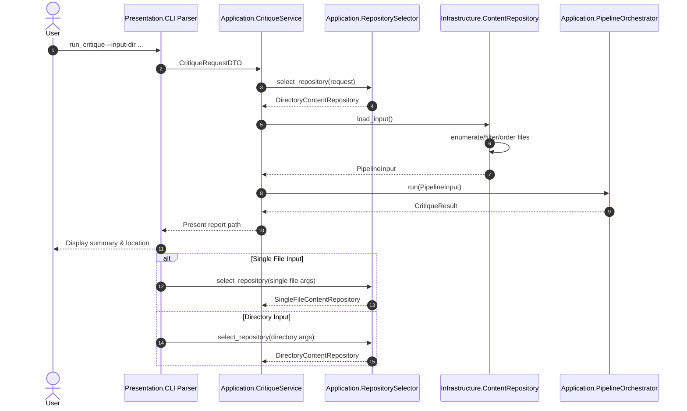

# Directory Input Sequence

This document captures the clean-architecture interactions required to ingest
either a single file or a directory tree when invoking the Critique Council CLI.
The goal is to make dependency flow explicit so that the presentation layer never
reaches into infrastructure details directly.

## Dependency Validation

- The presentation layer terminates after creating a DTO and handing the request
to the application service.
- The application layer owns the `ContentRepository` interface and orchestrates
repository selection through dependency injection.
- Only infrastructure implementations touch the file system. They return pure
`PipelineInput` DTOs defined in the shared domain/application layer.
- The pipeline orchestrator consumes the DTO without awareness of where the
content originated.

This flow satisfies the dependency rule (`presentation → application → domain ←
infrastructure`) and avoids any shims between the CLI and repository
implementations.
